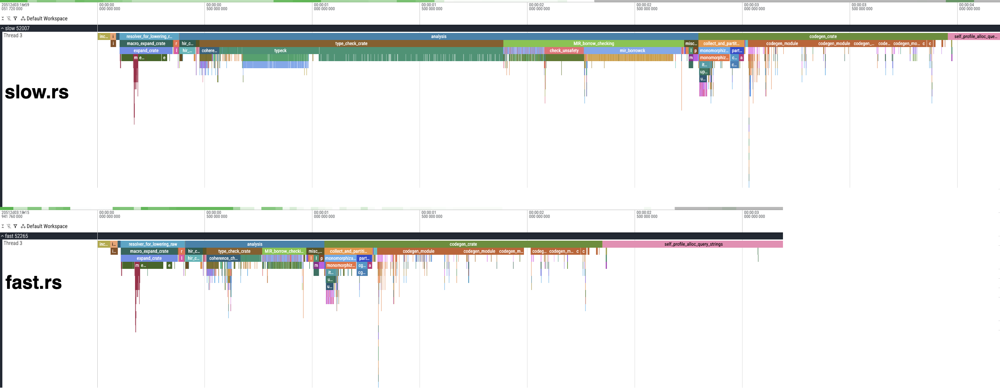

## Minimal repro demonstrating incremental compilation issues with `tauri::generate_handler!`


This repo has 300 tauri commands and a bunch of LLM-generated dummy structs.

`command_1` returns `SlopStruct1`.

`command_2`..`command_299` returns `SlopStruct2`.


`slow.rs` uses `tauri::generate_handler!` as usual:

```
# clear the cache and warm it up
cargo clean --workspace
cargo build --bin slow
cargo build --bin slow

# add a new field to `SlopStruct1`. e.g. `foo: String`
cargo build --bin slow # takes 4.5s
```

`fast.rs` includes a macro that wraps each handler in a function. This appears to help with the typechecking cache.

```
# clear the cache and warm it up
cargo clean --workspace
cargo build --bin fast
cargo build --bin fast

# add a new field to `SlopStruct1`
cargo build --bin fast # takes 2.5s
```



